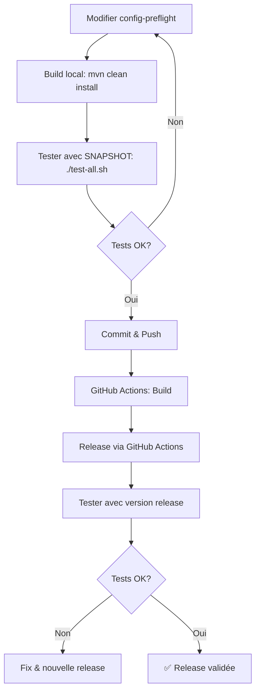

# Guide de Test Config Preflight

Ce guide explique comment utiliser les projets de test pour valider le fonctionnement de config-preflight.

## 📋 Vue d'ensemble

Les projets de test permettent de :
1. Valider que config-preflight détecte correctement les propriétés manquantes
2. Tester avec différentes versions (release ou snapshot)
3. Vérifier le comportement sur les 3 frameworks supportés

## 🎯 Scénarios de test

### Scénario 1 : Test avec la version SNAPSHOT locale

```bash
# Depuis la racine du projet
mvn clean install -DskipTests

# Tester un framework spécifique
cd tests/spring-boot-test
./test.sh

# Ou tester tous les frameworks
cd tests
./test-all.sh
```

### Scénario 2 : Test avec une version release spécifique

```bash
cd tests/spring-boot-test
./test.sh 1.0.0

# Ou pour tous les frameworks
cd tests
./test-all.sh 1.0.0
```

### Scénario 3 : Test après une release

Après avoir fait une release via GitHub Actions :

```bash
# Attendre que la version soit disponible sur Maven Central
# Puis tester avec la nouvelle version
cd tests
./test-all.sh 1.0.0
```

## 🔍 Que vérifie chaque test ?

### Propriétés configurées (devraient fonctionner)
- ✅ `database.url`
- ✅ `database.username`
- ✅ `database.max-connections`
- ✅ `api.api-key`
- ✅ `api.retry-count`
- ✅ `api.enable-cache`
- ✅ `messaging.broker-url`
- ✅ `messaging.username`
- ✅ `messaging.password`
- ✅ `messaging.auto-reconnect`

### Propriétés manquantes (devraient être détectées)
- ❌ `database.password`
- ❌ `database.timeout`
- ❌ `api.endpoint`
- ❌ `api.cache-directory`
- ❌ `messaging.queue-name`
- ❌ `messaging.connection-timeout`

## 📊 Résultats attendus

### Comportement attendu avec config-preflight

Lorsque config-preflight est correctement configuré, vous devriez voir :

1. **Au démarrage** : Un rapport listant toutes les propriétés manquantes
2. **Dans les logs** : Des messages clairs indiquant les propriétés non valorisées
3. **Échec du démarrage** : L'application ne devrait pas démarrer si des propriétés sont manquantes

Exemple de sortie attendue :

```
╔═══════════════════════════════════════════════════════════════╗
║           Configuration Validation Failed                     ║
╠═══════════════════════════════════════════════════════════════╣
║ The following configuration properties are missing:          ║
║                                                               ║
║  • database.password                                          ║
║  • database.timeout                                           ║
║  • api.endpoint                                               ║
║  • api.cache-directory                                        ║
║  • messaging.queue-name                                       ║
║  • messaging.connection-timeout                               ║
╚═══════════════════════════════════════════════════════════════╝
```

## 🛠️ Modification des tests

### Ajouter de nouvelles propriétés à tester

1. **Modifier la classe de configuration** (ex: `DatabaseConfig.java`)
   ```java
   private String newProperty;
   
   public String getNewProperty() {
       return newProperty;
   }
   
   public void setNewProperty(String newProperty) {
       this.newProperty = newProperty;
   }
   ```

2. **Ne pas ajouter la propriété dans le fichier de configuration** (`application.yml`)
   ```yaml
   database:
     url: jdbc:postgresql://localhost:5432/testdb
     # newProperty: missing - should trigger validation error
   ```

3. **Ajouter un test** (optionnel)
   ```java
   @Test
   void testNewPropertyMissing() {
       // Config-preflight should detect this
       assertNull(databaseConfig.getNewProperty());
   }
   ```

### Modifier le comportement attendu

Si vous voulez tester des propriétés optionnelles :

1. Annotez la propriété comme optionnelle dans votre implémentation
2. Ajoutez la propriété dans le fichier de configuration
3. Config-preflight ne devrait plus la signaler comme manquante

## 🐛 Debugging

### Les tests ne détectent pas les propriétés manquantes

Vérifiez que :
1. Config-preflight est bien dans les dépendances
2. La version utilisée est correcte
3. Les classes de configuration sont bien annotées (`@ConfigurationProperties`, `@ConfigMapping`, etc.)

### Erreurs de compilation

```bash
# Nettoyer et reconstruire
mvn clean compile
```

### Problèmes de dépendances

```bash
# Forcer la mise à jour des dépendances
mvn clean install -U
```

## 📝 Bonnes pratiques

1. **Toujours tester localement** avant de faire une release
2. **Vérifier les 3 frameworks** pour s'assurer de la compatibilité
3. **Documenter les nouveaux cas de test** dans ce guide
4. **Mettre à jour les versions** des frameworks régulièrement

## 🔄 Workflow de développement



## 📞 Support

En cas de problème :
1. Vérifier les logs Maven
2. Consulter la documentation principale
3. Ouvrir une issue sur GitHub avec :
   - Version de config-preflight
   - Framework et version
   - Logs complets
   - Configuration utilisée
